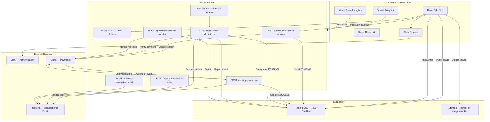
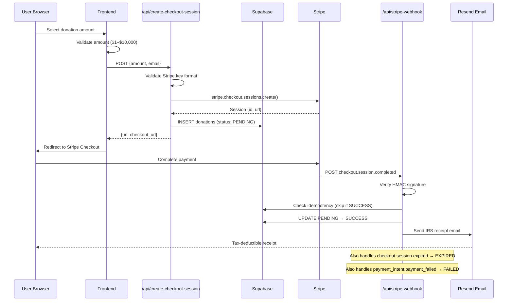
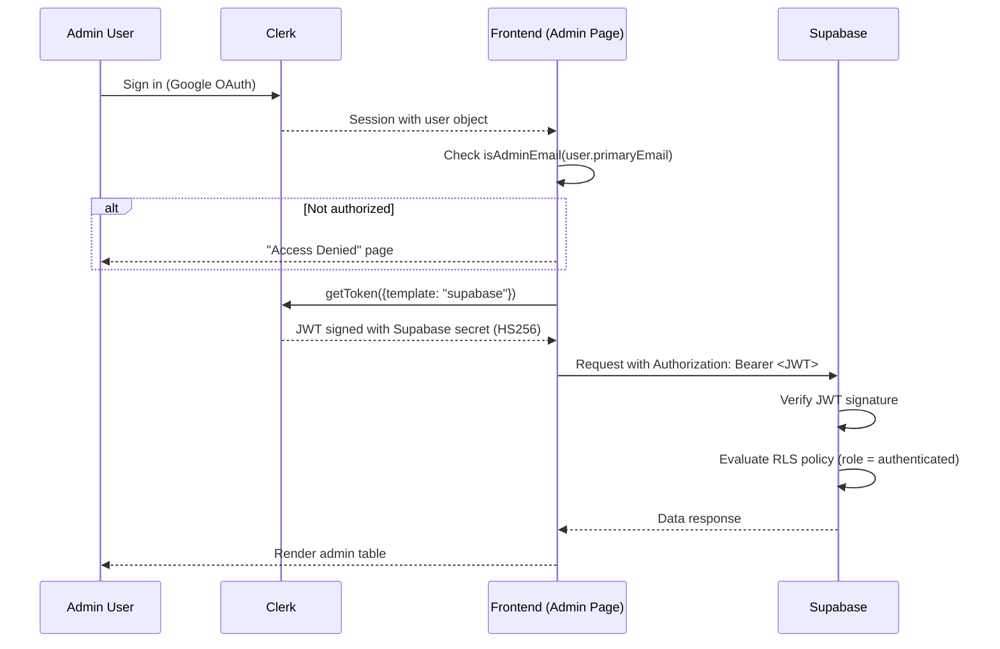
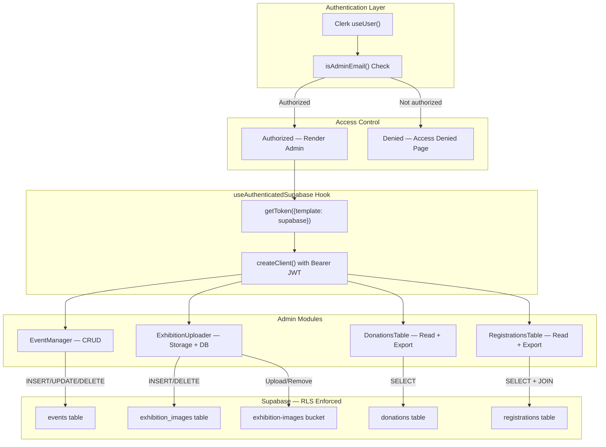
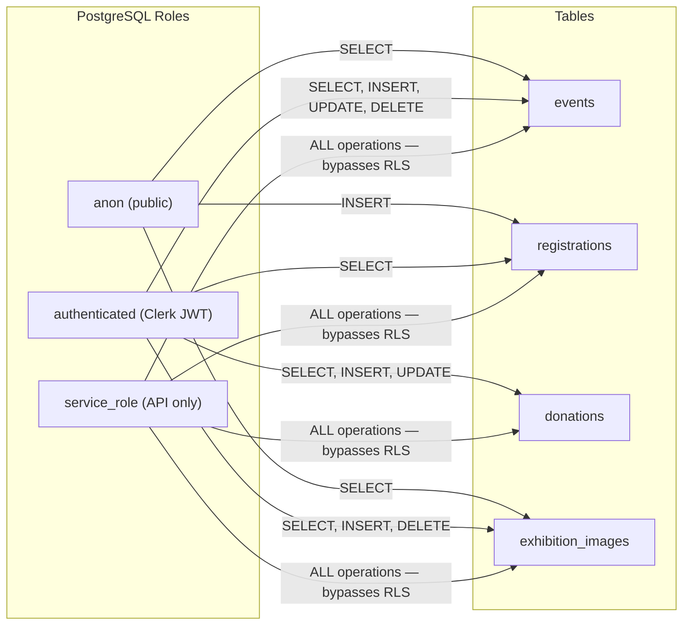
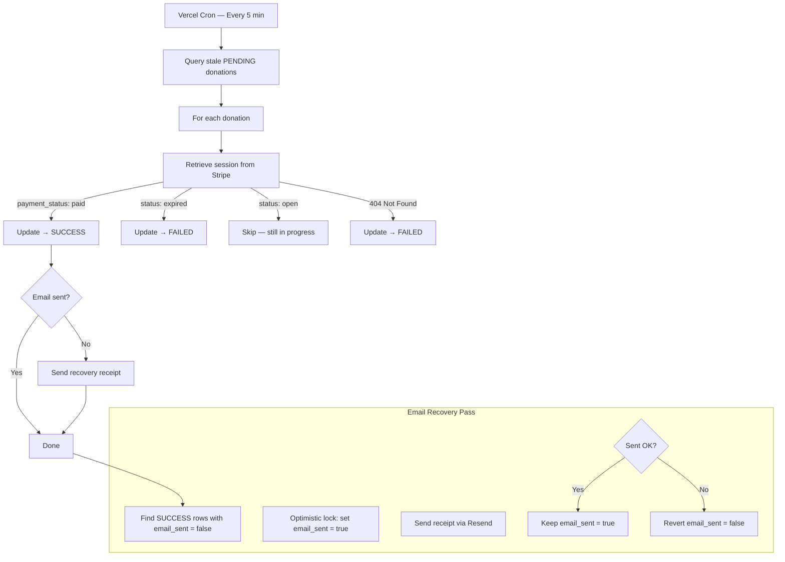
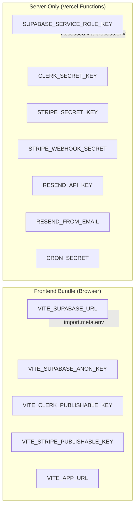

# Architecture

Detailed technical architecture for the India Museum & Heritage Society of Rhode Island platform.

This document covers the complete system architecture, data flows, authentication model, and security boundaries. For setup instructions, see [DEPLOYMENT.md](DEPLOYMENT.md). For a project overview, see [README.md](README.md).

---

## Table of Contents

- [System Overview](#system-overview)
- [Complete System Architecture](#complete-system-architecture)
- [Stripe Payment Flow](#stripe-payment-flow)
- [Authentication Flow](#authentication-flow)
- [Admin Panel Data Flow](#admin-panel-data-flow)
- [Database RLS Model](#database-rls-model)
- [Supabase Client Strategy](#supabase-client-strategy)
- [Vercel Serverless Architecture](#vercel-serverless-architecture)
- [Donation Reconciliation System](#donation-reconciliation-system)
- [Environment Variable Security Model](#environment-variable-security-model)
- [Storage Architecture](#storage-architecture)

---

## System Overview

The platform is a single-page React application (SPA) served by Vercel, with serverless API functions handling payment processing, webhook verification, email delivery, and automated reconciliation. All persistent data is stored in Supabase (PostgreSQL), with file uploads going to Supabase Storage. Authentication is managed by Clerk, with JWT tokens bridging Clerk sessions to Supabase RLS policies.

---

## Complete System Architecture



---

## Stripe Payment Flow



### Fault Tolerance

The payment pipeline handles several failure modes:

| Failure | Recovery |
|---|---|
| DB insert fails before checkout | Webhook creates a fresh `SUCCESS` row when no `PENDING` row is found |
| Webhook signature invalid | Returns 400 — Stripe retries with backoff |
| Webhook DB update fails | Reconciliation cron detects stale `PENDING` and repairs via Stripe API |
| Email delivery fails | Reconciliation cron recovers unsent emails for `SUCCESS` donations |
| Webhook processing error | Always returns 200 to prevent infinite Stripe retry loops |

---

## Authentication Flow



### JWT Bridge: Clerk → Supabase

The Clerk-Supabase integration uses a JWT template named `supabase` that:

1. Signs tokens with Supabase's JWT secret using **HS256**
2. Includes the `sub` claim (Clerk user ID) and `role` claim (`authenticated`)
3. Is requested via `getToken({ template: 'supabase' })` in the `useAuthenticatedSupabase` hook
4. Is passed as a Bearer token in the `Authorization` header to Supabase
5. Supabase verifies the signature and sets the request's role to `authenticated`

---

## Admin Panel Data Flow



---

## Database RLS Model



### Policy Details

| Table | `anon` (Public) | `authenticated` (Admin) | `service_role` (API) |
|---|---|---|---|
| `events` | SELECT | SELECT, INSERT, UPDATE, DELETE | All (RLS bypassed) |
| `registrations` | INSERT only | SELECT | All (RLS bypassed) |
| `donations` | None | SELECT, INSERT, UPDATE | All (RLS bypassed) |
| `exhibition_images` | SELECT | SELECT, INSERT, DELETE | All (RLS bypassed) |

> The `service_role` key is used exclusively in Vercel serverless functions (`api/` directory) and bypasses all RLS policies. It is never exposed to the frontend.

---

## Supabase Client Strategy

The application uses three distinct Supabase client configurations, each with different access levels:

### 1. Public Client (`supabase`)

```typescript
// src/lib/supabaseClient.ts
export const supabase = createClient(SUPABASE_URL, SUPABASE_ANON_KEY)
```

- **Role:** `anon`
- **Used for:** Reading events, reading exhibition images, inserting registrations
- **Access:** Governed by RLS policies for the `anon` role
- **Created:** Once, at module initialization

### 2. Authenticated Client Factory (`getAuthenticatedSupabase`)

```typescript
// src/lib/supabaseClient.ts
export const getAuthenticatedSupabase = async (getToken) => {
  const token = await getToken({ template: 'supabase' })
  return createClient(SUPABASE_URL, SUPABASE_ANON_KEY, {
    global: { headers: { Authorization: `Bearer ${token}` } },
    auth: { persistSession: false, autoRefreshToken: false }
  })
}
```

- **Role:** `authenticated`
- **Used for:** All admin write operations (events CRUD, exhibition uploads, viewing donations/registrations)
- **Access:** Governed by RLS policies for the `authenticated` role
- **Created:** On-demand per operation via the `useAuthenticatedSupabase` hook

### 3. Service Role Client (API Routes)

```typescript
// api/*.ts
const supabaseAdmin = createClient(
  process.env.VITE_SUPABASE_URL,
  process.env.SUPABASE_SERVICE_ROLE_KEY
)
```

- **Role:** `service_role` (bypasses RLS)
- **Used for:** Webhook processing, donation record updates, reconciliation, email tracking
- **Access:** Full database access — no RLS restrictions
- **Created:** In each API function handler, server-side only

---

## Vercel Serverless Architecture

All backend logic runs as Vercel serverless functions, defined in the `api/` directory:

| Function | Method | Purpose | Auth |
|---|---|---|---|
| `create-checkout-session` | POST | Create Stripe session + insert PENDING donation | Public (amount validated) |
| `stripe-webhook` | POST | Process Stripe events → update DB → send emails | Stripe signature (HMAC) |
| `reconcile-donations` | GET | Cron: detect stale PENDING → verify Stripe → repair | `CRON_SECRET` header |
| `send-donation-email` | POST | Standalone IRS receipt email endpoint | None (internal use) |
| `send-registration-email` | POST | Event registration confirmation email | None (internal use) |
| `admin/reconcile-donation` | POST | Manual single-donation reconciliation | `CRON_SECRET` header |

### Webhook Body Parsing

The Stripe webhook handler disables Vercel's automatic body parser to access the raw request body for signature verification:

```typescript
export const config = { api: { bodyParser: false } }
```

A custom `getRawBody()` function handles both raw stream parsing (when `bodyParser` is correctly disabled) and re-serialization (when Vercel's body parser pre-consumes the stream).

### Cron Configuration

```json
// vercel.json
{
  "crons": [
    {
      "path": "/api/reconcile-donations",
      "schedule": "*/5 * * * *"
    }
  ]
}
```

The reconciliation cron runs every 5 minutes, detecting donations stuck in `PENDING` status beyond a configurable threshold (default: 5 minutes). It queries Stripe for each session's true payment status and repairs the database accordingly.

---

## Donation Reconciliation System

The reconciliation system is a multi-component fault-tolerance mechanism:



### Operating Modes

| Mode | Trigger | Behavior |
|---|---|---|
| **Standard** | `GET /api/reconcile-donations` | Process PENDING donations older than 5 minutes |
| **Historical** | `GET /api/reconcile-donations?mode=historical` | Process all PENDING donations regardless of age |

---

## Environment Variable Security Model



**Key security boundary:** Vite only bundles environment variables prefixed with `VITE_` into the client bundle (via `import.meta.env`). All server-only secrets use `process.env` and are exclusively available in Vercel serverless functions — they are never part of the static frontend build.

---

## Storage Architecture

### Supabase Storage — `exhibition-images` Bucket

```
exhibition-images/
├── faith/          # Faith & Philosophy category
│   ├── 1716000000-abc123.jpg
│   └── ...
├── art/            # Art & Architecture category
├── music/          # Music & Dance category
├── literature/     # Literature & Languages category
└── ethnic/         # Ethnic Traditions category
```

- **Bucket visibility:** Public read (images served directly via Supabase CDN URLs)
- **Upload method:** Authenticated Supabase client via the admin ExhibitionUploader component
- **File naming:** `{timestamp}-{random}.{ext}` to prevent collisions
- **Max file size:** 10 MB (enforced client-side)
- **Accepted types:** JPEG, PNG, WebP, GIF
- **Deletion:** Both the storage file and the `exhibition_images` database row are deleted together

### Static Assets — `public/images/`

```
public/images/
├── logo.png                 # Museum logo
├── museum-hero.png          # Homepage hero background
├── leadership/              # Board member portraits
│   ├── president.jpeg
│   ├── founder.jpeg
│   ├── patron.jpeg
│   ├── treasurer.jpeg
│   ├── secretary.jpeg
│   ├── mahinder-paul.png
│   └── santosh-paul.png
└── museum-building/         # Museum building photos
```

Static assets are served directly by Vercel's CDN, compiled into the production build by Vite, and cached at the edge.
