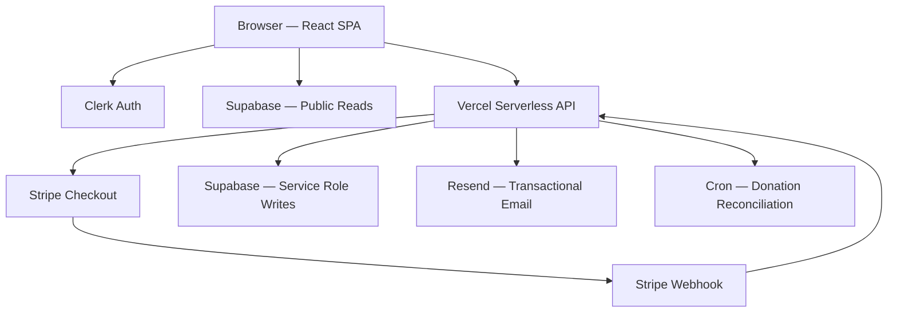

<p align="center">
  
</p>

<h1 align="center">India Museum & Heritage Society of Rhode Island</h1>

<p align="center">
  Full-stack museum platform powering exhibitions, events, Stripe donations, and administrative operations for a 501(c)(3) nonprofit cultural institution.
</p>

<p align="center">
  
  
  
  
  
  
  
  
  
</p>

---

## Project Overview

The India Museum and Heritage Society of Rhode Island (EIN: 05-0505459) preserves and celebrates India's artistic, cultural, and historical legacy in the heart of Providence, RI. This platform is the museum's primary digital presence — providing visitors with an immersive gateway to curated exhibition galleries organized by cultural themes (Faith & Philosophy, Art & Architecture, Music & Dance, Literature & Languages, and Ethnic Traditions), community events with online registration, and a tax-deductible donation system with IRS-compliant receipts.

The platform is a production-grade, full-stack application deployed on Vercel. The frontend is a single-page React application compiled with Vite and styled with TailwindCSS, delivering a responsive experience across all devices. The backend consists of Vercel serverless functions handling secure Stripe payment processing with webhook signature verification, transactional email delivery via Resend, and automated donation reconciliation via cron. Clerk provides authentication, and Supabase serves as the database and file storage layer — with Row Level Security ensuring that administrative operations (event management, exhibition uploads, donation records) are accessible only to authorized museum staff.

## Live Site

| | |
|---|---|
| **Production URL** | [https://indiamuseumri.org](https://indiamuseumri.org) |
| **Admin Dashboard** | [https://indiamuseumri.org/admin](https://indiamuseumri.org/admin) — restricted to authorized email |

## Features

| Public Features | Admin Features |
|---|---|
| Exhibition galleries by cultural category | Event CRUD with status toggle (Open / Closed / Coming Soon) |
| Dynamic event listings from Supabase | Exhibition image upload to Supabase Storage |
| Event registration with form validation | Donations dashboard with status filters & search |
| Stripe donation checkout ($1–$10,000) | Registrations table with event join & search |
| IRS-compliant tax receipt emails via Resend | CSV export for donations and registrations |
| Payment success/cancel result pages | Real-time data refresh from Supabase |
| Scroll-animated section transitions | Email-whitelist admin authentication |
| Fully responsive mobile-first layout | Dashboard statistics overview |

## Tech Stack

| Technology | Purpose | Version |
|---|---|---|
| React | UI component library | 18.3.1 |
| TypeScript | Type-safe JavaScript | 5.x |
| Vite | Build tool and dev server | 6.3.5 |
| TailwindCSS | Utility-first CSS framework | 4.1.12 |
| Supabase | PostgreSQL database + Storage + RLS | 2.101.1 |
| Clerk | Authentication and session management | 5.61.4 |
| Stripe | Payment processing (Checkout + Webhooks) | 22.x |
| Resend | Transactional email delivery | 6.10.x |
| Vercel | Hosting, serverless functions, cron jobs | — |
| Vercel Analytics | Pageview tracking | 2.0.1 |
| Vercel Speed Insights | Core Web Vitals monitoring | 2.0.0 |
| React Router | Client-side routing (SPA) | 7.14.x |
| Motion (Framer) | Animation library | 12.23.x |

## System Architecture



> For the full architecture deep-dive with data flow diagrams, see [ARCHITECTURE.md](ARCHITECTURE.md).

## Payment Pipeline

The donation system follows a robust, multi-stage pipeline with built-in fault tolerance:

1. **User selects amount** — Preset ($25, $50, $100, $250) or custom amount ($1–$10,000) with client-side validation
2. **Frontend calls API** — `POST /api/create-checkout-session` with amount and optional donor email
3. **PENDING record inserted** — Server creates a `PENDING` donation row in Supabase before returning the Stripe URL
4. **Stripe Checkout session created** — Session includes product description with EIN and 501(c)(3) status
5. **User completes payment** — Stripe handles card processing on their hosted checkout page
6. **Webhook fires** — Stripe sends `checkout.session.completed` to `/api/stripe-webhook`
7. **Signature verified** — Server verifies the webhook payload using `STRIPE_WEBHOOK_SECRET` (HMAC)
8. **Status updated** — `PENDING` → `SUCCESS` with donor name, email, and payment intent ID
9. **IRS receipt sent** — Resend delivers a tax-deductible donation receipt email with EIN, amount, date, and confirmation ID
10. **Reconciliation** — Cron job runs every 5 minutes to detect and repair stale `PENDING` records by querying Stripe directly

Additional webhook handlers process `checkout.session.expired` → `EXPIRED` and `payment_intent.payment_failed` → `FAILED`.

## Database Schema

### `events`

| Column | Type | Description |
|---|---|---|
| `id` | `uuid` | Primary key (auto-generated) |
| `title` | `text` | Event title |
| `category` | `text` | Event category (Community, Workshop, Performance, Lecture) |
| `date` | `date` | Event date |
| `time` | `text` | Display time string (e.g., "5:00 PM – 9:00 PM") |
| `location` | `text` | Venue name |
| `description` | `text` | Full event description |
| `status` | `text` | OPEN, CLOSED, or COMING_SOON |
| `image_url` | `text` | Optional event image URL |

### `registrations`

| Column | Type | Description |
|---|---|---|
| `id` | `uuid` | Primary key (auto-generated) |
| `event_id` | `uuid` | Foreign key → `events.id` |
| `full_name` | `text` | Registrant's full name |
| `phone_number` | `text` | Contact phone number |
| `preferred_time` | `text` | Preferred time slot (morning / afternoon / evening) |
| `created_at` | `timestamptz` | Registration timestamp |

### `donations`

| Column | Type | Description |
|---|---|---|
| `id` | `uuid` | Primary key (auto-generated) |
| `amount` | `numeric` | Donation amount in USD |
| `donor_name` | `text` | Donor's full name (from Stripe) |
| `donor_email` | `text` | Donor's email address |
| `status` | `text` | PENDING, SUCCESS, FAILED, or EXPIRED |
| `stripe_session_id` | `text` | Stripe Checkout session ID |
| `stripe_payment_id` | `text` | Stripe PaymentIntent ID |
| `email_sent` | `boolean` | Whether IRS receipt email was delivered |
| `created_at` | `timestamptz` | Donation creation timestamp |
| `reconciled_at` | `timestamptz` | Last reconciliation timestamp |
| `reconciliation_count` | `integer` | Number of reconciliation passes |

### `exhibition_images`

| Column | Type | Description |
|---|---|---|
| `id` | `uuid` | Primary key (auto-generated) |
| `title` | `text` | Image title |
| `image_url` | `text` | Public URL from Supabase Storage |
| `category` | `text` | Exhibition category (faith, art, music, literature, ethnic) |
| `created_at` | `timestamptz` | Upload timestamp |

### `leadership_profiles`

| Column | Type | Description |
|---|---|---|
| `id` | `uuid` | Primary key |
| `name` | `text` | Leader's full name |
| `role` | `text` | Position title |
| `bio` | `text` | Biography text |
| `image_url` | `text` | Profile image URL |
| `is_memorial` | `boolean` | Memorial/tribute flag |
| `rank` | `integer` | Display order |

> **Note:** Leadership data is currently served from static content in `src/data/leadershipContent.ts`. Migration to Supabase is planned.

## Security

- **Stripe webhook HMAC verification** — Every webhook payload is verified using `stripe.webhooks.constructEvent()` with the `STRIPE_WEBHOOK_SECRET` before any database operation
- **Admin email whitelist** — Admin panel access is restricted to a single authorized email address (`isAdminEmail()` check against Clerk user's primary email)
- **Supabase Row Level Security** — All tables enforce RLS policies: public `SELECT` for events and exhibitions, authenticated-only access for donations and registrations
- **Service role isolation** — `SUPABASE_SERVICE_ROLE_KEY` is used exclusively in server-side API routes (Vercel functions), never exposed to the frontend
- **Clerk JWT integration** — Admin operations use Clerk's `getToken({ template: 'supabase' })` to obtain a JWT signed with Supabase's secret, which is then passed as a Bearer token to satisfy RLS policies
- **Environment variable separation** — `VITE_` prefixed variables are client-safe (publishable keys); all secret keys (`STRIPE_SECRET_KEY`, `SUPABASE_SERVICE_ROLE_KEY`, etc.) are server-only
- **No secrets in frontend bundle** — Secret keys are never imported with `import.meta.env` in client code

## Project Structure

```
india-museum/
├── api/                              # Vercel serverless functions
│   ├── create-checkout-session.ts    # Stripe Checkout session creation + PENDING insert
│   ├── stripe-webhook.ts            # Webhook handler: signature verify → DB update → email
│   ├── reconcile-donations.ts       # Cron: detect stale PENDING → verify Stripe → repair
│   ├── send-donation-email.ts       # Standalone IRS receipt email endpoint
│   ├── send-registration-email.ts   # Event registration confirmation email
│   └── admin/
│       └── reconcile-donation.ts    # Manual single-donation reconciliation
├── src/
│   ├── main.tsx                     # Root entry: ClerkProvider → BrowserRouter → App
│   ├── app/
│   │   ├── App.tsx                  # React Router: routes + HomePage component
│   │   └── components/             # Public-facing page components
│   │       ├── Navigation.tsx       # Fixed navbar with scroll-aware styling
│   │       ├── Hero.tsx             # Hero section with background image
│   │       ├── CulturalGrid.tsx     # Exhibition category cards
│   │       ├── Events.tsx           # Dynamic event listings from Supabase
│   │       ├── DonationStrip.tsx    # Donation amount selector + Stripe redirect
│   │       ├── Visit.tsx            # Museum visit information
│   │       ├── Leadership.tsx       # Board members and benefactors
│   │       ├── IndiaAmerica.tsx     # Editorial section
│   │       ├── Footer.tsx           # Site footer
│   │       └── PaymentNotification.tsx  # Success/cancel popup overlay
│   ├── components/
│   │   └── admin/                   # Protected admin modules
│   │       ├── AdminSidebar.tsx     # Navigation sidebar
│   │       ├── AdminStats.tsx       # Dashboard statistics cards
│   │       ├── EventManager.tsx     # Event CRUD with status toggle
│   │       ├── ExhibitionUploader.tsx  # Image upload to Supabase Storage
│   │       ├── DonationsTable.tsx   # Donation records with filters + CSV export
│   │       └── RegistrationsTable.tsx  # Registration records with search + CSV export
│   ├── data/                        # Content data layer (editorial text)
│   ├── hooks/                       # Custom React hooks
│   │   ├── useAuthenticatedSupabase.ts  # Clerk JWT → authenticated Supabase client
│   │   └── useIntersection.ts       # IntersectionObserver hook
│   ├── lib/                         # Client configuration
│   │   ├── supabaseClient.ts        # Public + authenticated Supabase client factory
│   │   └── adminAuth.ts             # Admin email whitelist
│   ├── pages/                       # Route-level page components
│   │   ├── Admin.tsx                # Admin layout with auth guard + nested routes
│   │   ├── ExhibitionGallery.tsx    # Category-based exhibition gallery
│   │   ├── DonationSuccess.tsx      # Post-payment success redirect
│   │   └── DonationCancel.tsx       # Post-payment cancel redirect
│   └── styles/
│       └── index.css                # Global styles and CSS custom properties
├── public/
│   └── images/                      # Static assets (logo, hero, leadership photos)
├── vercel.json                      # Vercel config: SPA rewrites + cron schedule
├── vite.config.ts                   # Vite config: React plugin, TailwindCSS, path aliases
├── package.json                     # Dependencies and scripts
└── tsconfig.json                    # TypeScript configuration
```

## Environment Variables

| Variable | Purpose | Used In |
|---|---|---|
| `VITE_SUPABASE_URL` | Supabase project URL | Frontend (client) |
| `VITE_SUPABASE_ANON_KEY` | Supabase anonymous/public key | Frontend (client) |
| `SUPABASE_SERVICE_ROLE_KEY` | Supabase service role key (bypasses RLS) | Backend (API routes only) |
| `VITE_CLERK_PUBLISHABLE_KEY` | Clerk publishable key | Frontend (client) |
| `CLERK_SECRET_KEY` | Clerk secret key | Backend (API routes only) |
| `VITE_STRIPE_PUBLISHABLE_KEY` | Stripe publishable key | Frontend (client) |
| `STRIPE_SECRET_KEY` | Stripe secret key (`sk_live_` or `sk_test_`) | Backend (API routes only) |
| `STRIPE_WEBHOOK_SECRET` | Stripe webhook signing secret (`whsec_`) | Backend (webhook handler) |
| `RESEND_API_KEY` | Resend API key for email delivery | Backend (API routes only) |
| `RESEND_FROM_EMAIL` | Verified sender email address | Backend (API routes only) |
| `VITE_APP_URL` | Production URL for Stripe redirect URLs | Backend (checkout session) |

> ⚠️ Variables without the `VITE_` prefix are **server-only** and never exposed to the browser. The `VITE_` prefix is required by Vite to make variables available in client code via `import.meta.env`.

## Local Development Setup

```bash
# 1. Clone the repository
git clone https://github.com/indiamuseumri/India_Museum_Ri.git
cd India_Museum_Ri

# 2. Install dependencies
npm install

# 3. Create environment file
cp .env.example .env

# 4. Fill in all environment variables in .env
#    (see Environment Variables section above)

# 5. Start the development server
npm run dev

# 6. Open the application
#    http://localhost:5173
```

## Supabase Setup

1. Create a new project at [supabase.com/dashboard](https://supabase.com/dashboard)
2. Create the following tables using the SQL editor:

```sql
-- Events table
CREATE TABLE events (
  id UUID DEFAULT gen_random_uuid() PRIMARY KEY,
  title TEXT NOT NULL,
  category TEXT,
  date DATE NOT NULL,
  time TEXT NOT NULL,
  location TEXT NOT NULL,
  description TEXT NOT NULL,
  status TEXT DEFAULT 'COMING_SOON',
  image_url TEXT
);

-- Registrations table
CREATE TABLE registrations (
  id UUID DEFAULT gen_random_uuid() PRIMARY KEY,
  event_id UUID REFERENCES events(id),
  full_name TEXT NOT NULL,
  phone_number TEXT NOT NULL,
  preferred_time TEXT NOT NULL,
  created_at TIMESTAMPTZ DEFAULT NOW()
);

-- Donations table
CREATE TABLE donations (
  id UUID DEFAULT gen_random_uuid() PRIMARY KEY,
  amount NUMERIC NOT NULL,
  donor_name TEXT,
  donor_email TEXT,
  status TEXT DEFAULT 'PENDING',
  stripe_session_id TEXT,
  stripe_payment_id TEXT,
  email_sent BOOLEAN DEFAULT FALSE,
  created_at TIMESTAMPTZ DEFAULT NOW(),
  reconciled_at TIMESTAMPTZ,
  reconciliation_count INTEGER DEFAULT 0
);

-- Exhibition images table
CREATE TABLE exhibition_images (
  id UUID DEFAULT gen_random_uuid() PRIMARY KEY,
  title TEXT NOT NULL,
  image_url TEXT NOT NULL,
  category TEXT NOT NULL,
  created_at TIMESTAMPTZ DEFAULT NOW()
);
```

3. **Enable RLS** on all tables — `ALTER TABLE <table> ENABLE ROW LEVEL SECURITY;`
4. Create RLS policies:
   - `events`: public `SELECT`, authenticated `INSERT/UPDATE/DELETE`
   - `exhibition_images`: public `SELECT`, authenticated `INSERT/DELETE`
   - `registrations`: public `INSERT`, authenticated `SELECT`
   - `donations`: authenticated `SELECT/INSERT/UPDATE`
5. Create a **Storage bucket** named `exhibition-images` with public read access
6. Configure **Third-Party Auth** with Clerk's issuer URL in Supabase project settings

## Clerk Setup

1. Create an application at [clerk.com/dashboard](https://dashboard.clerk.com)
2. Enable **Google OAuth** as a sign-in method
3. Create a **JWT Template** named `supabase` (case-sensitive, lowercase):
   - Select "Supabase" from the template list
   - Set the signing algorithm to **HS256**
   - Paste the **JWT Secret** from your Supabase project (Settings → API → JWT Settings)
4. Copy the Publishable Key → `VITE_CLERK_PUBLISHABLE_KEY`
5. Copy the Secret Key → `CLERK_SECRET_KEY`
6. Admin access is controlled via email whitelist in `src/lib/adminAuth.ts`

## Stripe Setup

1. Create a Stripe account at [stripe.com](https://stripe.com)
2. Obtain API keys from the [Stripe Dashboard](https://dashboard.stripe.com/apikeys):
   - Publishable key (`pk_live_...`) → `VITE_STRIPE_PUBLISHABLE_KEY`
   - Secret key (`sk_live_...`) → `STRIPE_SECRET_KEY`
3. Create a webhook endpoint at [Stripe Dashboard → Webhooks](https://dashboard.stripe.com/webhooks):
   - **Endpoint URL:** `https://indiamuseumri.org/api/stripe-webhook`
   - **Events to subscribe:**
     - `checkout.session.completed`
     - `checkout.session.expired`
     - `payment_intent.payment_failed`
     - `payment_intent.succeeded`
4. Copy the **Webhook Signing Secret** (`whsec_...`) → `STRIPE_WEBHOOK_SECRET`

## Resend Setup

1. Create an account at [resend.com](https://resend.com)
2. Add and **verify your domain** (DNS records required)
3. Create an **API key** → `RESEND_API_KEY`
4. Set `RESEND_FROM_EMAIL` to a verified sender address on your domain

## Vercel Deployment

1. Connect the GitHub repository to Vercel at [vercel.com](https://vercel.com)
2. Add **all environment variables** in Vercel Dashboard → Settings → Environment Variables
3. Deploy — Vercel auto-detects Vite for the frontend and the `api/` directory for serverless functions
4. Verify the webhook endpoint is accessible: `https://your-domain.org/api/stripe-webhook`
5. Set your **custom domain** in Vercel Dashboard → Settings → Domains
6. Enable **Vercel Analytics** and **Speed Insights** in the Vercel Dashboard

> For the complete deployment checklist, see [DEPLOYMENT.md](DEPLOYMENT.md).

## Analytics & Monitoring

| Service | What It Monitors |
|---|---|
| **Vercel Analytics** | Automatic pageview tracking across all routes |
| **Vercel Speed Insights** | Core Web Vitals (LCP, FID, CLS) |
| **Stripe Dashboard** | Payment volume, payouts, disputes, webhook delivery |
| **Supabase Dashboard** | Database queries, storage usage, RLS policy evaluation |
| **Vercel Function Logs** | Serverless function execution, errors, cold starts |

Both `<Analytics />` and `<SpeedInsights />` components are mounted unconditionally in the root React tree (`src/main.tsx`), tracking all page views including public pages and admin routes.

## Admin Dashboard

The admin panel is accessible at `/admin` and protected by Clerk authentication + email whitelist.

| Module | Path | Capabilities |
|---|---|---|
| **Dashboard** | `/admin` | Summary statistics: total donations, event count, registration count |
| **Event Manager** | `/admin/events` | Create, edit, delete events. Toggle status (Open → Closed → Coming Soon). All writes via authenticated Supabase client. |
| **Exhibition Uploader** | `/admin/exhibitions` | Category tabs (Faith, Art, Music, Literature, Ethnic). Upload images to Supabase Storage bucket `exhibition-images`. Delete images from both storage and database. |
| **Donations Table** | `/admin/donations` | View all donations with status badges (Success, Pending, Failed, Expired). Filter by status, search by name/email, paginate, export CSV. |
| **Registrations Table** | `/admin/registrations` | View all event registrations with event title join. Filter by event, search by name, paginate, export CSV. |

## Roadmap

- [ ] PDF receipt generation for offline tax records
- [ ] Leadership profiles fetched from Supabase `leadership_profiles` table
- [ ] Newsletter subscription system
- [ ] Multi-language support (Hindi, Punjabi, Gujarati)
- [ ] Analytics dashboard within the admin panel
- [ ] Attendee email collection for registration confirmations

## License

This project is licensed under the [MIT License](LICENSE).

---

<p align="center">
  <strong>India Museum and Heritage Society of Rhode Island</strong><br/>
  58 Tell Street, Providence, RI · EIN: 05-0505459 · 501(c)(3) Nonprofit
</p>